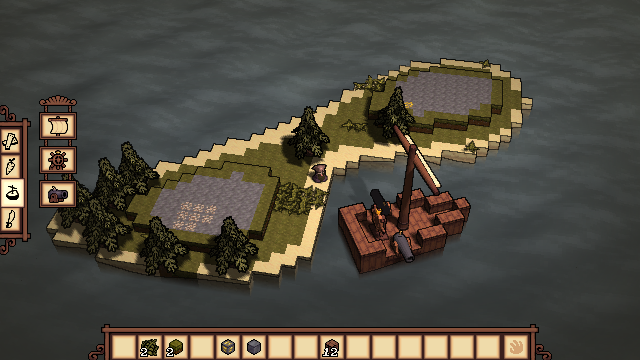

A massively multiplayer online game featuring 3D pixel graphics, OOB collision detection/resolution and procedurally generated terrain. 

 

This is a diploma project for Tullinge Gymnasium made by me, Melvin Bentinger, over the course of seven months. I believe that where this game shines the most is in its originality. The reason for why it was created in the first place was because I could not find anything like it and have always wanted to play a game like Sea of Thieves, with the same freedom as Minecraft. Even though I am very happy with how the project has turned out so far, the game is still far from complete. 

## Features:

* Over 17 Items!

* Play with up to (as many as a computer can handle) friends

* Engaging naval combat

* Swashbuckling

* Nostalgic pixel graphics

* Trees

The game is programmed without the use of a pre-existing game engine or framework. Instead OpenGL is used to send instructions to the graphics card, and GLM for most linear algebra. The game is programmed and compiled in Visual Studio 2019 and models are made using blender, while most textures are made in Aseprite

## Controls:

* Movement: WASD

* Rotate Camera: Q & E

* Break: Hold left mouse button

* Place: Click left mouse button with item

* Interact: Tap space

* Exit: Escape

To play the game, run the .exe file found in the "Build" folder.
